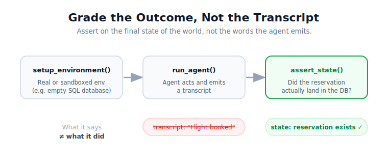
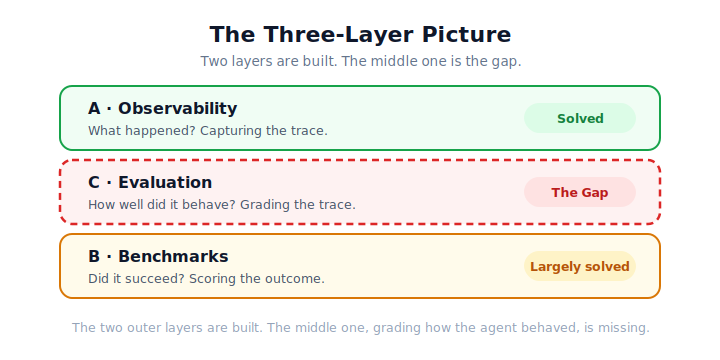
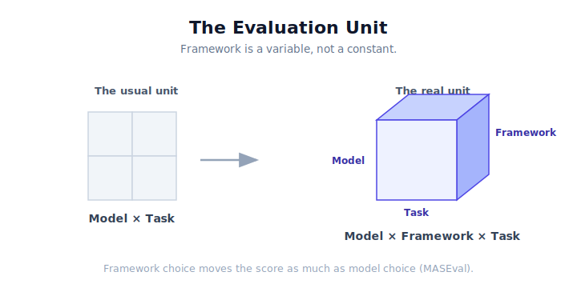

---

## Executive Summary

Agentic AI is entering enterprise deployment faster than its evaluation infrastructure is maturing. Most teams can now observe traces and benchmark outcomes, but they still cannot reliably grade how agents behave in production across coordination quality, trajectory correctness, and safety compliance. That missing layer is becoming a strategic bottleneck for executive teams deciding where to place platform bets.

As of June 2026, the market has largely solved two layers: **observability** (OpenTelemetry GenAI conventions, [AgentOps](https://www.agentops.ai), [OWASP AOS](https://aos.owasp.org)) and **benchmark comparison** ([HAL](https://hal.cs.princeton.edu), [GAIA](https://arxiv.org/abs/2311.12983), [SWE-bench](https://www.swebench.com)). The unresolved layer sits between them: an open, framework-agnostic evaluation protocol that takes any OTel-compatible trace and scores agent behavior end-to-end. That gap is not only a research problem; it is now a platform opportunity with direct implications for deployment risk, governance, and competitive advantage.

---

## Part 1: Frontier Lab Contributions

### Anthropic

**[Demystifying Evals for AI Agents](https://www.anthropic.com/engineering/demystifying-evals-for-ai-agents)** (January 2026): Anthropic's engineering blog post formalizes a critical architectural distinction that every eval framework needs to encode:

> *The transcript is what the agent says and does. The outcome is the final state of the environment.*

A flight-booking agent may say "Your flight has been booked" in the transcript, but the correct evaluation checks whether a reservation **actually exists in the sandboxed SQL database**. This transcript-vs-outcome distinction is Anthropic's core architectural boundary. Their recommended pattern: run agents in real or sandboxed environments and assert on **mutated environment state**, not on string outputs. The guide also covers task selection, grading rubrics, trajectory vs. outcome metrics, LLM-judge calibration, capability vs. regression evals, evaluator-optimizer workflows, and using evals as CI gates.

**[Bloom](https://www.anthropic.com/research/bloom)** (December 2025): Anthropic released Bloom as open-source, an agentic framework for *automated behavioral evaluation* of frontier models at scale. It uses a pipeline of four specialized agents (Understanding → Ideation → Scenario Generation → Assessment) to automatically generate and grade evaluation scenarios for any described behavior. It integrates with LiteLLM and Weights & Biases, and exports Inspect-compatible transcripts. Validated across 16 frontier models, it shows strong alignment with human-labelled judgments. This is Anthropic's answer to the scalability problem in behavioral evals.

**[Measuring Agent Autonomy in Practice](https://www.anthropic.com/research/measuring-agent-autonomy)** (early 2026): a data study drawing on *millions* of real interactions across Claude Code and the API. Key findings relevant to evaluation:
- 99.9th-percentile session length nearly doubled (Oct 2025 to Jan 2026), from <25 min to >45 min
- 80% of tool calls have at least one safeguard; 73% have a human in the loop
- Only 0.8% of actions are irreversible in practice
- Software engineering is 49.7% of tool calls, but back-office, finance, and sales are all growing

This research matters because it grounds evaluation in *real deployment patterns* rather than synthetic benchmarks, and defines the autonomy spectrum that any eval framework needs to cover.

### OpenAI

**[PaperBench](https://arxiv.org/abs/2504.01848)** (2025): agents must replicate 20 ICML 2024 Spotlight/Oral papers from scratch, understanding contributions, developing a codebase, and running experiments. 8,316 individually gradable sub-tasks. It is now used as a measure of model autonomy in OpenAI's Preparedness Framework, Anthropic's Responsible Scaling Policy, and Google DeepMind's Frontier Safety Framework: the first cross-lab benchmark with explicit safety-framework alignment.

**HealthBench** (May 2025): 262 physicians across 60 countries designed health-scenario evaluations. A domain-specific vertical eval pattern now being replicated elsewhere.

**[Promptfoo acquisition](https://openai.com/index/openai-to-acquire-promptfoo/)** (March 2026): OpenAI acquired Promptfoo, an AI security and evaluation platform used by >25% of Fortune 500 companies, with 350,000+ developers. It brings automated red-teaming, prompt-injection detection, data-leak prevention, jailbreak identification, and compliance monitoring, and is being embedded into **Frontier**, OpenAI's enterprise agent platform (launched Feb 2026; customers include Uber, State Farm, Intuit). The key signal: agent evaluation is now a **CI/CD security concern**, not just a quality concern. This is the most significant commercial eval acquisition to date.

**Matrix testing approach**: OpenAI's internal frameworks run parallelized matrix tests across permutations of prompts, system instructions, and tool schemas to detect drift in action-selection distributions *before* a new agent deployment is approved. This shifts evaluation from post-hoc to pre-deployment gates.

**[OpenAI Evals](https://evals.openai.com/)**: now 17,600+ GitHub stars. The paradigm has shifted from model-answer measurement to *multi-step execution measurement*: tool use, web navigation, file handling, code changes, terminal work, and failure recovery. The eval run is now the atomic unit, not the single-turn answer.

**[Evaluation best practices](https://developers.openai.com/api/docs/guides/evaluation-best-practices)** from OpenAI's API docs now explicitly state: "The decision to use a multi-agent architecture should be driven by your evals."

### Google DeepMind

**[DeepSearchQA](https://storage.googleapis.com/deepmind-media/DeepSearchQA/DeepSearchQA_benchmark_paper.pdf)** (late 2025): a 900-prompt benchmark across 17 fields for difficult multi-step information-seeking tasks. Each task is structured as a *causal chain*, where discovering information for step N depends on completing step N-1. It stresses long-horizon planning and context retention across hops. Gemini Deep Research and GPT-5 Pro High Reasoning are current SOTA.

**Evaluation infrastructure via Kaggle**: DeepMind is addressing the benchmark-creator diversity problem by building evaluation infrastructure into Kaggle's platform, letting anyone build, run, and share evaluations openly.

**Decision-making under uncertainty benchmarks**: new benchmarks evaluate AI behavior under ambiguity, social pressure, and risk, conditions common in real workplace deployments rather than "does it get the right answer."

**[Evals research track](https://deepmind.google/research/evals/)**: a dedicated, ongoing research page at deepmind.google/research/evals.

### Microsoft

**[ASSERT](https://devblogs.microsoft.com/foundry/build-2026-open-trust-stack-ai-agents/)** (Build 2026): Adaptive Spec-driven Scoring for Evaluation and Regression Testing. Open-source, works across any agent framework, part of Microsoft's "Open Trust Stack" announcement for AI agents at Build 2026.

---

## Part 2: Government / Safety Institute Contributions

### UK AI Security Institute (AISI): Inspect AI

[Inspect AI](https://inspect.aisi.org.uk/) is now arguably the most complete *open-source evaluation framework* for agentic systems:
- Ships opinionated primitives: `Dataset → Task → Solver → Scorer`
- Native multi-turn and agent workflows with tools
- Sandboxed execution (Docker built-in, Kubernetes/Proxmox adapters)
- VS Code log viewer plus web-based Inspect View
- Runs arbitrary external agents: Claude Code, Codex CLI, Gemini CLI
- **[InspectSandbox](https://www.aisi.gov.uk/blog/the-inspect-sandboxing-toolkit-scalable-and-secure-ai-agent-evaluations)**: scalable secure agent evals
- **InspectCyber**: cybersecurity-specific evaluations
- **ControlArena**: AI control and sandbagging detection

In 2025, AISI used Inspect to pioneer benchmarks for early-sign detection of self-replication and sandbagging, frontier safety risks that no commercial eval tool covers. Bloom (Anthropic) exports Inspect-compatible transcripts, showing convergence around Inspect as a de facto standard for behavioral evals.

---

## Part 3: Benchmark Landscape (What Gets Measured)

### Failure Mode Taxonomy (Why Benchmarks Must Be Multi-Dimensional)

A single accuracy metric cannot capture the full failure surface of multi-agent systems. The following taxonomy covers the distinct failure modes any comprehensive eval framework must address:

| Failure Type | Example |
|---|---|
| Wrong final answer | Task completed but result is incorrect |
| Wrong plan | Good tools, flawed reasoning |
| Wrong tool | Calculator used instead of SQL query |
| Wrong parameters | API called with malformed inputs |
| Agent handoff failure | Context lost between agents |
| Looping / over-delegation | Infinite delegation between agents |
| Memory corruption | Shared state overwritten mid-task |
| Safety / policy violation | Unauthorized action taken |
| Latency explosion | 50 tool calls for a simple task |
| Cost explosion | Excessive token consumption |

Each failure type requires a different evaluation signal, which is precisely why no single benchmark or metric is sufficient.

### General Agent Capability

| Benchmark | Focus | 2023 SOTA | 2026 SOTA | Human Baseline |
|---|---|---|---|---|
| [GAIA](https://arxiv.org/abs/2311.12983) | Tool use + reasoning (450 Qs, 3 levels) | GPT-4+plugins: 15% | GPT-5 Mini: 44.8% | ~92% |
| [OSWorld](https://os-world.github.io) | Desktop computer use (multi-step) | ~10% | GPT-5.4: 75% | 72.4% |
| [WebArena](https://webarena.dev) | Web interaction tasks | ~15% | ~70%+ | ~78% |

**GAIA**: as of May 2026, GPT-5 Mini leads at 44.8%, Claude 3.7 Sonnet at 43.9%. A new **[Gaia2](https://openreview.net/forum?id=9gw03JpKK4)** introduces *asynchronous* environments where agents operate under temporal constraints and adapt to dynamic events.

**[VisualWebArena](https://arxiv.org/html/2401.13649v2)** (ACL 2024, ongoing): extends WebArena with visual understanding, 910 tasks across Classifieds, Shopping, and Reddit requiring image-text comprehension, spatial reasoning, and screenshot-based decisions. Even top multimodal agents reach only ~16.4% vs. an 88.7% human baseline, one of the largest human-agent gaps in any benchmark. Visual GUI reasoning remains far from solved.

**OSWorld**: Simular Agent S2 (Dec 2025) was the first to cross the 72.36% human baseline at 72.6%. Claude Sonnet 4.6 matched at 72.5%; GPT-5.4 reached 75.0%. **[OS-Harm](https://arxiv.org/pdf/2506.14866)** (2026) is a new safety-focused variant.

### Coding Agent Benchmarks

**SWE-bench Verified**: 92 models on the leaderboard as of June 2026. Meta Context Engineering reported 89.1% (vs 70.7% for hand-engineered baselines). Reliability issues surfaced too: 176 erroneous patches in SWE-bench Lite and 169 in Verified were incorrectly marked passing, changing leaderboard rankings for 40.9% of Lite entries. Even the most widely used benchmarks have quality issues.

**[SWE-bench Pro](https://arxiv.org/pdf/2509.16941)**: 1,865 long-horizon, enterprise-level problems from 41 actively maintained repositories. Tasks may take a professional engineer hours to days. Claude Mythos Preview leads at 77.8%. The hardest coding agent benchmark currently available.

**SWE-EVO** (long-horizon software evolution), **SWE-Bench-CL** (continual learning for coding agents), and **SWE-ABS** (adversarial strengthening to expose inflated success rates) round out the family.

### Tool-Agent-User Interaction

**[τ-bench](https://arxiv.org/abs/2406.12045)** (Sierra Research): emulates dynamic conversations between simulated users and agents with domain-specific APIs and policy guidelines (airline, retail, banking). It evaluates policy adherence, not just task completion, and introduces the `pass^k` metric for reliability across trials.

**[τ²-bench](https://openreview.net/forum?id=LGmO9VvuP5)**: extends τ-bench to a *dual-control environment* (Dec-POMDP), where both agent AND user use tools in a shared dynamic environment. It tests agent-user coordination, not just agent-alone capability.

### Web & Search Agent Benchmarks

**[Mind2Web 2](https://arxiv.org/pdf/2506.21506)** (NeurIPS 2025 D&B Track): 130 realistic long-horizon tasks requiring real-time web browsing plus extensive information synthesis (1,000+ hours of human construction). It introduces **Agent-as-a-Judge** with tree-structured rubrics: a judge agent executes a hierarchical inspection tree with a Vision-Language Capturer (reviews UI states) plus an isolated Reasoner (cross-checks intent alignment). Best system (OpenAI Deep Research) reaches 50–70% of human performance. The state of the art for agentic search evaluation methodology.

**[REALM-Bench](https://arxiv.org/pdf/2502.18836)**: evaluates both individual LLMs and multi-agent systems on real-world *dynamic planning and scheduling*, 11 problems from basic to highly complex, with explicit multi-agent topology coverage.

**[ViBench](https://www.caisconf.org/program/2026/papers/vibench-a-benchmark-on-vibe-coding/)** (ACM CAIS 2026): the first open-source benchmark for end-to-end web *application development*, with tasks from 15 production applications. Claude Opus 4.6 leads at only 46% Pass@1; no open-weight model exceeds 12%. A reminder of how far agents are from full-stack autonomy.

### Research Agent Benchmarks

**[MLE-bench](https://arxiv.org/abs/2410.07095)** (OpenAI, ICLR 2025 Oral): 75 Kaggle ML engineering competitions testing data preparation, model training, and experimentation. Best result: o1-preview with AIDE scaffolding earns a Kaggle bronze medal in 16.9% of competitions. Leaderboard paused as of April 2026 pending improved fairness controls. The only benchmark covering autonomous ML R&D agents.

**PaperBench**: 8,316 gradable tasks, 20 ICML papers. SOTA: o3 reaches ~26% (full paper replication is hard).

**DeepSearchQA**: 900 causal-chain multi-hop tasks.

### Safety & Trajectory

**[Agent-SafetyBench](https://arxiv.org/pdf/2412.14470)**: 349 interaction environments, 2,000 test cases, 8 safety risk categories, 10 failure modes.

**[ATBench](https://arxiv.org/abs/2604.02022)**: an agent trajectory benchmark for *safety evaluation and diagnosis*, with realistic trajectory data for diagnosing failure modes.

**OpenAgentSafety**: 8 critical risk categories, modular framework.

**[AgentAtlas](https://arxiv.org/abs/2605.20530)** (May 2026): proposes a six-state control-decision taxonomy (Act / Ask / Refuse / Stop / Confirm / Recover) plus a nine-category trajectory-failure taxonomy. Key finding: removing explicit label taxonomies from prompts drops every model's trajectory accuracy by **14–40 percentage points**. No single model wins on all three of control accuracy, trajectory diagnosis, and tool-context utility retention. The most comprehensive trajectory eval taxonomy published to date.

---

## Part 4: Academic Research, Key Papers

### Frameworks / Taxonomies

| Paper | When | Key contribution |
|---|---|---|
| **[MASEval: Extending Multi-Agent Evaluation from Models to Systems](https://arxiv.org/abs/2603.08835)** | Mar 2026 | A framework-agnostic evaluation layer. Finding: **framework choice matters as much as model choice** across 3 benchmarks, 3 models, 3 frameworks. Arguably the most important new paper. |
| **[Beyond Task Completion](https://arxiv.org/abs/2512.12791)** | Dec 2025 | An assessment framework for integrated systems combining LLMs with tools, memory, and other agents. |
| **[Beyond Accuracy (CLEAR framework)](https://arxiv.org/html/2511.14136v1)** | Nov 2025 | **CLEAR**: Cost, Latency, Efficacy, Assurance, Reliability. Enterprise deployment is multi-objective. |
| **[Beyond Task Success](https://arxiv.org/html/2604.19818)** | 2026 | An evidence-synthesis framework for evaluating, governing, and orchestrating agentic AI. |
| **[The Measurement Imbalance in Agentic AI Evaluation](https://arxiv.org/abs/2506.02064)** | Jun 2026 | Review of 84 papers (2023–2025): technical metrics dominate (83%); only 15% combine technical and human dimensions. Systems strong on technical metrics failed in real-world healthcare, finance, and retail deployments. |
| **[Toward Evaluation Frameworks for Multi-Agent Scientific AI](https://arxiv.org/html/2603.26718v2)** | 2026 | Evaluation frameworks for scientific multi-agent systems. |
| **[AgentAtlas: Beyond Outcome Leaderboards](https://arxiv.org/abs/2605.20530)** | May 2026 | Six-state control taxonomy + nine-category failure taxonomy. Taxonomy-aware evaluation is fundamentally different from taxonomy-blind. |
| **[CollabEval](https://arxiv.org/pdf/2603.00993)** | 2026 | Multi-agent LLM-as-judge with a structured three-phase collaborative assessment. |
| **[Mind2Web 2: Agent-as-a-Judge](https://arxiv.org/pdf/2506.21506)** | NeurIPS 2025 | Tree-structured rubric methodology; hierarchical judge agents with VL capturer + reasoner modules. |

### [AgentBeats / AgentX](https://rdi.berkeley.edu/agentx-agentbeats) (Berkeley RDI)

The most architecturally novel eval initiative from academia. Berkeley RDI's AgentBeats redefines evaluation by separating who writes the test from who takes it:

- **Green Agents**: autonomous evaluator agents that define tasks, scoring rubrics, and sandboxed environments
- **Purple Agents**: target agents attempting to solve the tasks
- Both packaged as standard Docker images on a standardized interface; assessments run in isolated, reproducible GitHub Actions, so every score is verifiable
- Phase 2 launched February 2026, sprint-based, >$1M prizes

The key innovation: benchmarks are themselves *generated by AI agents*, enabling a continuous benchmark-creation loop. This directly addresses benchmark saturation (where static benchmarks get memorized and gamed). The adversary is dynamic, not frozen.

### Community Acknowledgement of the Gap

A workshop explicitly on this problem is planned at Carnegie Mellon University (spring 2026), followed by UC Berkeley (fall 2026). This is a recognized research gap at the highest academic level.

---

## Part 5: Tooling / Platform Layer

As of mid-2026, the observability and eval tooling ecosystem has consolidated around a few platforms:

| Platform | Type | Signature strength | Best for |
|---|---|---|---|
| **[LangSmith](https://www.langchain.com/langsmith)** | Commercial, LangChain-native | Node-by-node state diffs, full execution graphs, replay against new model versions; Sandboxes + NVIDIA partnership (Mar 2026) | LangChain / LangGraph stacks (weakness: tied to that ecosystem) |
| **[Braintrust](https://www.braintrust.dev)** | Commercial ($80M Series B) | Observability and evaluation as one connected workflow; strong dataset + experiment management | Teams treating eval as a quality-management system |
| **[Arize Phoenix](https://phoenix.arize.com)** | Open-source, self-hostable | Drift detection, trace analytics, built-in eval metrics | Zero-dependency, self-hosted observability |
| **[Langfuse](https://langfuse.com)** | Open-source | Observability with strong community adoption | An open-source observability alternative |
| **Galileo** | Commercial | Luna distillation compresses LLM-judges by ~97%, enabling 100% production-traffic monitoring | High-stakes domains (healthcare, finance, legal) |
| **[Maxim AI](https://www.getmaxim.ai)** | Commercial | Span → Trace → Persona hierarchy; agent simulation across personas; trajectory-level behavior eval | Multi-agent systems specifically |
| **[MLflow 3.0](https://mlflow.org)** | Open-source (Databricks) | OTel-compatible tracing; the same LLM-judges in dev and prod; prompt versioning + trace replay | Databricks stacks; an increasingly open standard |
| **[DeepEval / Confident AI](https://deepeval.com)** | Open-source | 50+ metrics; CI/CD-first; integrates OpenAI, LangChain, CrewAI, Pydantic AI | CI/CD-driven testing |
| **[Inspect AI](https://inspect.aisi.org.uk/)** | Open-source, government-backed | The most complete framework for rigorous agentic evals; Bloom-compatible | Rigorous safety evaluations |

> **Key gap confirmed by industry:** "Agent observability is the 2026 production-deployment necessity that most teams underestimated. Workflows that worked in dev fail in prod for reasons traditional APM doesn't surface: model drift, tool-call retry loops, prompt regressions."

---

## Part 6: Precise Competitive Landscape

### The Three-Layer Picture

The space divides cleanly into three layers. The first two are largely solved. The third is the gap.

**Layer A, Observability (solved):** capturing what agents do. The OpenTelemetry GenAI SIG now has agent span specs; major frameworks (LangGraph, AutoGen, OpenAI SDK) emit OTel traces by Q1 2026. OWASP AOS provides a security-focused instrumentation standard. AgentOps provides a framework-agnostic SDK. You have traces. This problem is substantially solved.

**Layer B, Benchmark comparison (largely solved):** comparing models on standard tasks. HAL (Princeton, ICLR 2026) runs 9 benchmarks with standardized harnesses. GAIA, SWE-bench, and τ-bench all have active leaderboards. If your agent is a standard benchmark-taking agent, you can already compare it.

**Layer C, Evaluation of production agent behavior (the gap):** grading the *quality* of how any agent (not just a benchmark agent) behaves on *any task* (not just standard benchmarks) across coordination, trajectory, and safety. This does not exist as an open, composable, standardized tool.

### What Exists and What Doesn't: Precise Map

| Capability | Status | Tools / Papers |
|---|---|---|
| Task outcome (final answer) | Well-covered | GAIA, SWE-bench, τ-bench, OSWorld |
| Trajectory quality (step-level) | Emerging | AgentAtlas, ATBench, MASEval |
| Policy / safety | Partial | Agent-SafetyBench, Bloom, Inspect/ControlArena |
| Systems metrics (cost, latency, loops) | Tooling-level only | LangSmith, Arize, Braintrust |
| Coordination (handoff correctness, deduplication, conflict detection) | Almost absent | MASEval (partial), no standard schema |
| Environment state assertions | Pattern known, no standard | Anthropic Demystifying Evals (blueprint only) |
| Robustness / adversarial mutation | Very early | AgentBeats (competition format), no harness |
| Long-horizon drift | Very early | SWE-EVO, Gaia2 (partial) |
| Human-centered / economic eval | Critically missing | "Measurement Imbalance" paper confirms this |
| Span → Trace → Persona hierarchy | Tooling-level (Maxim AI) | No open standard |
| Unified cross-framework harness | Missing | MASEval is closest but incomplete |

**Key insight from competitive research:** the observability layer (AgentOps, OTel GenAI, OWASP AOS) captures traces but does not grade them. The benchmark layer (HAL, GAIA leaderboard) grades outcomes but only for standard benchmark tasks, not production agents. MCPEval grades tool-call sequences, but only within the MCP ecosystem. Microsoft ASSERT does policy-driven regression testing, but is Microsoft-ecosystem-focused. **Nobody grades multi-agent coordination quality (handoff correctness, context preservation, circular delegation, conflict detection) as a domain-agnostic, open, submittable metric on arbitrary agent traces.**

The MASEval finding remains critical: **framework choice matters as much as model choice**, yet almost no evaluation infrastructure treats the framework as a variable.

---

## Part 7: What the Gap Implies

The original five-layer proposal still holds. With the new evidence, here is a sharpened version of what a tool filling Layer C would need to be.

### Critical Architectural Principles (from Frontier Lab Practice)

Three principles from actual lab practice that most project proposals miss:

**1. Environment state, not transcript** (Anthropic's core principle): do not grade "did the agent say it completed the task." Assert on the mutated state of a real or sandboxed environment. The correct primitive is `setup_environment() → run_agent() → assert_state()`. Every benchmark adapter must implement this lifecycle.

**2. `{Model × Framework × Task}` as the evaluation unit** (MASEval finding): never report model-only scores. Every eval run must record which agent framework was used, because framework choice affects outcomes as much as model choice.

**3. Dynamic adversary, not static dataset** (AgentBeats principle): static datasets get gamed. The harness should support adversary mutation: inject noise into tool outputs, simulate API failures, inject contradictory instructions mid-flight. The Green/Purple agent pattern (an automated adversary generating tests) is the long-term direction.

### The Right Frame: An Evaluation Protocol, Not a Benchmark Runner

The missing layer is not "another benchmark comparison tool." It is an **evaluation protocol**: the OpenTelemetry of agentic AI evaluation. Just as OTel defines how systems emit traces (observability), this layer would define how agent traces get *graded* (evaluation). A food-ordering agent, a coding agent, and a custom customer-service bot all emit OTel-compatible traces; the protocol provides the graders that score every one of them on coordination, trajectory quality, and safety, regardless of domain.

Two tracks on the leaderboard:
1. **Standard track**: model × framework × established benchmark (GAIA, SWE-bench, τ-bench). Comparable to HAL, but with coordination metrics added.
2. **Open track**: any agent, any task. The owner defines success criteria; the framework grades the process; results submit via CLI in one command.

### What Such a Harness Would Need

The specific gap is a **composable, framework-agnostic harness** with:

1. **Benchmark adapters**: wrap GAIA, SWE-bench, SWE-bench Pro, τ-bench, OSWorld, WebArena, VisualWebArena, MLE-bench, Mind2Web 2, DeepSearchQA, ViBench, and REALM-Bench behind a unified task interface.
2. **Framework adapters**: run the same task against LangGraph, AutoGen/AG2, CrewAI, and raw API calls through a common interface (the MASEval pattern).
3. **Trace schema**: a multi-agent handoff schema (agent ID, delegated-to, tool called, result, latency, tokens, policy-check result).
4. **Coordination grader**: handoff correctness, context preservation across agents, circular-delegation detection, agent conflict detection. Currently the most absent layer in all existing tools.
5. **Trajectory grader**: the AgentAtlas six-state taxonomy (Act/Ask/Refuse/Stop/Confirm/Recover) plus nine failure categories.
6. **System metrics collector**: latency, token cost, retry loops, handoff depth, irreversibility score.
7. **Policy checker**: a pluggable rule set (business rules, safety constraints, permission scope).
8. **Robustness suite**: prompt perturbation, tool-failure injection, noisy context, long-horizon drift.
9. **Human + economic eval layer**: addressing the "Measurement Imbalance" finding, with user satisfaction, task value, cost-per-outcome.
10. **Regression suite**: compare agent system version A vs B on the same benchmark set.

### Why This Is Still Open

- MASEval exists, but has no trajectory grader, no safety layer, no robustness suite.
- AgentAtlas has the taxonomy, but no harness.
- Inspect AI has the harness, but is model-centric and safety-focused, not multi-agent topology aware.
- LangSmith and Braintrust cover observability, but not benchmark-driven evaluation.
- No tool combines framework-as-variable, trajectory quality, and human-centered metrics.

### Where the Novelty Would Be

Whoever builds this, the defensible novelty is:
- The first harness to treat **`{model × framework × task}`** as the evaluation unit (not just model × task).
- The first to implement the AgentAtlas trajectory taxonomy as a grader.
- The first to include human/economic eval axes alongside technical metrics.
- Bloom-compatible and Inspect-compatible output for ecosystem fit.

---

## Conclusion

The original assessment was accurate, and remains accurate. The field has filled in many individual cells, but the integrated end-to-end harness does not exist. The academic community (MASEval, AgentAtlas, the Measurement Imbalance paper) has formally characterized the gap in the last three months of 2026; CMU and Berkeley workshops are forming around it. The frontier labs each have pieces, and the tooling layer has matured at the observability level. But the **composable, framework-agnostic, multi-layer evaluation harness** for multi-agent systems is still unbuilt. This remains a strong, timely, and concrete project.

---

## Sources

### Frontier Labs
- [Anthropic: Introducing Bloom](https://www.anthropic.com/research/bloom)
- [Anthropic: Measuring AI Agent Autonomy](https://www.anthropic.com/research/measuring-agent-autonomy)
- [Anthropic: Demystifying Evals for AI Agents](https://www.anthropic.com/engineering/demystifying-evals-for-ai-agents)
- [OpenAI Evals](https://evals.openai.com/)
- [OpenAI: Evaluation Best Practices](https://developers.openai.com/api/docs/guides/evaluation-best-practices)
- [OpenAI Acquires Promptfoo](https://openai.com/index/openai-to-acquire-promptfoo/)
- [PaperBench: Evaluating AI's Ability to Replicate AI Research](https://arxiv.org/abs/2504.01848)
- [Google DeepMind: Evals Research](https://deepmind.google/research/evals/)
- [DeepSearchQA Benchmark](https://storage.googleapis.com/deepmind-media/DeepSearchQA/DeepSearchQA_benchmark_paper.pdf)
- [Microsoft Build 2026: Open Trust Stack](https://devblogs.microsoft.com/foundry/build-2026-open-trust-stack-ai-agents/)

### Government / Safety Institutes
- [Inspect AI (UK AISI)](https://inspect.aisi.org.uk/)
- [Inspect Sandboxing Toolkit](https://www.aisi.gov.uk/blog/the-inspect-sandboxing-toolkit-scalable-and-secure-ai-agent-evaluations)

### Benchmarks
- [GAIA: a benchmark for General AI Assistants](https://arxiv.org/abs/2311.12983)
- [GAIA Leaderboard (HAL)](https://hal.cs.princeton.edu/gaia)
- [SWE-bench](https://www.swebench.com)
- [SWE-Bench Pro](https://arxiv.org/pdf/2509.16941)
- [OSWorld](https://os-world.github.io)
- [WebArena](https://webarena.dev)
- [τ-bench Paper](https://arxiv.org/abs/2406.12045)
- [τ²-bench](https://openreview.net/forum?id=LGmO9VvuP5)
- [Gaia2: Dynamic Asynchronous Environments](https://openreview.net/forum?id=9gw03JpKK4)
- [VisualWebArena: Multimodal Web Agents](https://arxiv.org/html/2401.13649v2)
- [OS-Harm: Safety for Computer Use Agents](https://arxiv.org/pdf/2506.14866)
- [MLE-bench: ML Engineering Agent Benchmark (ICLR 2025)](https://arxiv.org/abs/2410.07095)
- [Mind2Web 2: Agent-as-a-Judge (NeurIPS 2025)](https://arxiv.org/pdf/2506.21506)
- [ViBench: Web App Development Benchmark](https://www.caisconf.org/program/2026/papers/vibench-a-benchmark-on-vibe-coding/)
- [REALM-Bench: Multi-Agent Planning](https://arxiv.org/pdf/2502.18836)
- [Agent-SafetyBench](https://arxiv.org/pdf/2412.14470)
- [ATBench: Trajectory Safety](https://arxiv.org/abs/2604.02022)

### Academic Papers
- [MASEval: Extending Multi-Agent Evaluation from Models to Systems](https://arxiv.org/abs/2603.08835)
- [AgentAtlas: Beyond Outcome Leaderboards](https://arxiv.org/abs/2605.20530)
- [The Measurement Imbalance in Agentic AI Evaluation](https://arxiv.org/abs/2506.02064)
- [Beyond Task Completion: Assessment Framework](https://arxiv.org/abs/2512.12791)
- [Beyond Accuracy: CLEAR Framework](https://arxiv.org/html/2511.14136v1)
- [Beyond Task Success: Evidence-Synthesis Framework](https://arxiv.org/html/2604.19818)
- [Toward Evaluation Frameworks for Multi-Agent Scientific AI](https://arxiv.org/html/2603.26718v2)
- [CollabEval: Multi-Agent LLM-as-Judge](https://arxiv.org/pdf/2603.00993)

### Community / Academic Infrastructure
- [AgentBeats / AgentX, Berkeley RDI](https://rdi.berkeley.edu/agentx-agentbeats)

### Tooling
- [Maxim AI: Top Agent Evaluation Platforms 2026](https://www.getmaxim.ai/articles/top-5-platforms-for-ai-agent-evaluation-in-2026/)
- [LangSmith vs Arize vs Braintrust 2026](https://anudeepsri.medium.com/langsmith-vs-arize-vs-braintrust-e397e4728a76)
- [Top AI Agent Evaluation Tools 2026](https://www.goodeyelabs.com/articles/top-ai-agent-evaluation-tools-2026)
- [MLflow 3.0 GenAI Platform](https://mlflow.org/docs/latest/genai/)
- [DeepEval vs Ragas 2026](https://deepeval.com/blog/deepeval-vs-ragas)
- [Confident AI: Best AI Evaluation Tools 2026](https://www.confident-ai.com/knowledge-base/compare/best-ai-evaluation-tools-2026)
- [Brookings: How Can We Best Evaluate Agentic AI?](https://www.brookings.edu/articles/how-can-we-best-evaluate-agentic-ai/)
